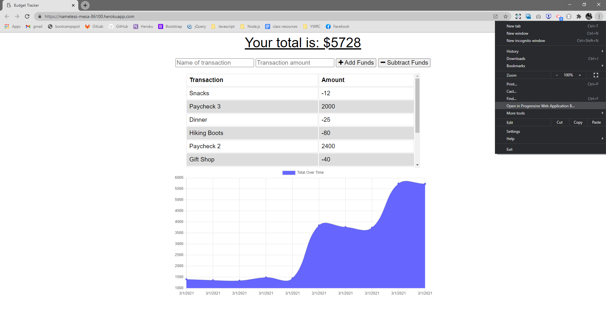
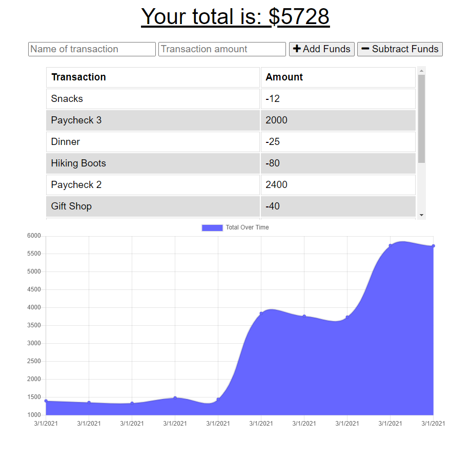

# Online/Offline Budget Tracker

## Description
In this repository you will find a Budget Tracker PWA that allows for offline access and functionality.

The user will be able to add expenses and deposits to their budget with or without a connection. When entering transactions offline, they will populate the total when brought back online. A graph depicting total funds is dynamically-updated and displayed in real time.


## Table of Contents
* [Installation](#installation)
* [Usage](#usage)
* [Contributing](#contributing)
* [Questions](#questions)
* [License](#license)


## Installation
To begin using this application, the user must first git clone this repository and open the terminal. Next, the user must install all dependencies by running the following command:

```bash
npm install
```


## Usage
This application will be invoked by running the following command:

```bash
node server.js
```


An option to install as a PWA is also provided:



For a more seamless experience, users are encouraged to [run the application online.](https://nameless-mesa-86100.herokuapp.com/)




[Watch a video walkthrough of the application.](https://drive.google.com/file/d/1CJry5gpmO5yjSqcL59YmJaf29nfPGI7f/view)


## Contributing
* [Node.js](https://nodejs.org/en/)
* [Express](http://expressjs.com/)
* [MongoDB](https://www.mongodb.com/)
* [Mongoose](https://mongoosejs.com/)
* [Chart.js](https://www.chartjs.org/)
* [Shields.io](https://shields.io/)


## Questions
Find [jaccihorvath on GitHub](https://github.com/jaccihorvath) or email [jacci@gmail.com](mailto:jacci@gmail.com) with additional questions.


## License
Copyright (c) [jaccihorvath](https://github.com/jaccihorvath).
Licensed under the MIT License.
